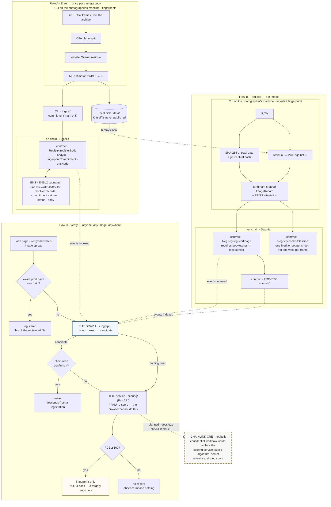

<p align="center">
  <picture>
    <source media="(prefers-color-scheme: dark)" srcset="logos/genesis-lockup-horizontal-white.png">
    
  </picture>
</p>

**Origin registry for photographers — prove an image came out of a specific camera body.**

ETHOnline 2026 · 4–16 September

---

> *Let there be light* — and a record of the sensor it fell on.

The photo world is trying to verify a negative — proving an image *wasn't*
AI-generated. It can't be done. We verify the positive instead: every image
sensor carries a permanent, per-body physical fingerprint (PRNU) that imprints
on every exposure and cannot exist in an image that never passed through it.
We register it and certify **origin, not truth**.
`docs/camera-sensors.md` is why that fingerprint exists and how K is recovered.

The record model follows the Birthmark Standard (arXiv 2602.04933,
`github.com/Birthmark-Standard/Birthmark`), which authenticates camera origin
from pixel data alone — NUC maps on professional bodies, PRNU on phones — and
explicitly scopes out the staged-photograph problem.

Its verification path references manufacturer key tables — a manufacturer
validates the NUC hash — and its own roadmap concedes that adoption needs
manufacturer firmware integration. We enrol from the photographer's own files
instead: 40+ RAW frames from an archive that already exists, with no
manufacturer and no platform involved. The camera's own data is the whole
input — K is estimated by maximum likelihood from the frames the body itself
produced, so nothing outside them is needed to enrol a body or to score an
image against it.

We certify: this image carries body X's sensor fingerprint **and body X's
owner registered it** · camera body registered to identity Y · first
registered at time T · these derivatives descend from that original.

A photographer needs no ENS name of their own. Each enrolled body gets a
subname under the operator's parent, and the contract never requires one —
`registerBody`'s `ensNode` may be zero. The ENS dependency is Genesis's, once.

The fingerprint alone certifies nothing: it can be planted by anyone holding
one RAW file off the body, invisibly (`docs/adversarial.md`). The owner's
registration is what carries the claim.

## The maths behind K

A sensor's photosites differ slightly in how much charge each returns for the
same light. That gain error is fixed at manufacture, unique to the die, and
it multiplies the signal rather than adding to it:

```
I = I⁰ + I⁰·K + Θ
```

`I` is what the sensor read, `I⁰` the light that fell on it, `K` the
per-pixel gain field — the fingerprint — and `Θ` everything else, shot noise
and dark current. Because K multiplies I⁰, a bright pixel carries more
evidence of K than a dark one, and a saturated pixel carries none.

Enrolment recovers K from frames alone. Each frame is denoised and the
denoised copy subtracted from the original, leaving a residual
`W = I − denoise(I)` that holds the fingerprint plus noise. Maximum likelihood over `d` frames then gives:

```
K̂ = Σ(Wₖ · Iₖ) / Σ(Iₖ²)
```

Each frame is weighted by its own intensity, which is exactly the weighting
the multiplicative model calls for. The model is linear, so this estimator is
minimum-variance unbiased and its variance falls as 1/d — more frames, a
sharper K, with no ceiling other than patience.

Verification asks whether a candidate image's residual contains that body's
fingerprint, scaled by the candidate's own intensity. The statistic is Peak
to Correlation Energy: correlate `W` against `I·K̂`, take the peak over all
shifts, divide its square by the energy in every other shift. PCE is used
rather than plain correlation because it is alignment-independent and its
null distribution is stable enough to set one threshold across bodies.

Two properties are what make this work retroactively. K is a property of the
silicon, not of the file, so stripping metadata removes nothing. And K is
never published — only a hash of it goes on chain, because a published
fingerprint is a forgery kit.

The same estimator that reads K can plant it. Measured on this body, one RAW
file is enough to forge a match at a distortion no eye sees, which is why
neither the references nor the enrolment frames are in this repository —
`docs/claims.md` has the reasoning and `docs/adversarial.md` the numbers.

The full derivation is Fridrich, *Digital Image Forensics Using Sensor Noise*,
IEEE Signal Processing Magazine 26(2), 2009: sensor model eq. (3), estimator
eq. (6), variance bound eq. (7), PCE eq. (14), denoiser in Appendix A.

## Where this stands on real cameras

One body has been tested: a Canon EOS R10, 41 CR3 frames, 16 enrolled. Every
one of the 25 frames that did not build the fingerprint scores as a match —
672 at worst, 56,255 at best, against a null of 29 to 43. That includes
frames up to 17.7% blown out.

It worked on frames that break four of the five enrolment conditions: ordinary
photographs rather than defocused flats, **C-RAW rather than lossless CR3**,
High ISO NR on, and mostly not base ISO. Surviving Canon's lossy raw
compression matters more than the rest, because C-RAW is what a great many
photographers actually shoot.

**A second R10 does not match.** The case that matters is two bodies of the
same model, sharing every model-level artefact and differing only in the
fingerprint. A different R10 (serial `022031004996` against our
`473034005088`, from `raw.pixls.us`) scores **39.1** against our fingerprint,
and −44.0 through the orientation search — the null band, where our own body
scores 629 to 56,255.

That is one negative sample, not a false-positive rate. It rules out the
approach being broken; it does not say how often a wrong body matches, which
needs dozens of bodies. The threshold sits at 100 — about twice the worst null
observed, well under the weakest true match — and is a floor with a margin
rather than a calibrated operating point.

**In-camera JPEGs carry no readable fingerprint.** The sharpest limit here,
and it went untested for weeks because the delivered-JPEG result used a
*desktop* development. Four JPEGs straight off the card — same body by serial
— score 24.7, 18.5, −29.2 and 29.6, the null band, colour and monochrome
alike. The same sensor developed from RAW on a desktop scores 1,148.

It is not geometry: measured by region, a desktop development grows with area
as PCE should (78 → 206 → 1,293) while the in-camera file is flat at the null
everywhere (24 → −27 → 30). The fingerprint is not displaced, it is gone. The
likely cause is in-camera noise reduction, and the irony is exact — PRNU is a
high-frequency, low-amplitude, spatially random signal, which is what a
denoiser exists to remove. **The camera deletes the fingerprint because to the
camera it is noise.**

So: enrol, register and verify from RAW or a desktop development. Monochrome
is *not* a problem — the same photograph desaturated scores 1,503 against
1,182 in colour.

Method, numbers and the rest of the findings are in `docs/gates.md`.

## Live on Sepolia

The registry is deployed, source-verified, and carries a real body and a real
photograph — not a local chain:

**[`0xDf71e9350B4cA587eb3Bd01F2e7D710F3Fc25CF3`](https://eth-sepolia.blockscout.com/address/0xDf71e9350B4cA587eb3Bd01F2e7D710F3Fc25CF3)**
· [transactions](https://eth-sepolia.blockscout.com/address/0xDf71e9350B4cA587eb3Bd01F2e7D710F3Fc25CF3?tab=txs)
· [Etherscan](https://sepolia.etherscan.io/address/0xDf71e9350B4cA587eb3Bd01F2e7D710F3Fc25CF3)

| Block | Call | Transaction |
| --- | --- | --- |
| 11659977 | deploy | [`0xb83e420b…`](https://eth-sepolia.blockscout.com/tx/0xb83e420b4b30dd317368fd50020459053d5a8d5df796865fcd4069ce6544454a) |
| 11660058 | `registerBody` | [`0x14d09e01…`](https://eth-sepolia.blockscout.com/tx/0x14d09e012a1b38752d5747185f834d1a1b119aa50fc1604274117d8bc95c46ad) |
| 11660059 | `registerImage` | [`0x1ed19fe6…`](https://eth-sepolia.blockscout.com/tx/0x1ed19fe69ffa448dbc2f15a098883ae2605141361c42fe71423e0773d53acd3a) |
| 11660060 | `commitSession` | [`0x2d580e61…`](https://eth-sepolia.blockscout.com/tx/0x2d580e61fcc0071a15511e266214f96f1b7ecf5bbea9d6453e0390e53a074511) |

`registerImage` emits two events: `ImageRegistered`, and an ERC-7053 `Commit`
under `genesis:2224a686…` so an indexer that knows only the standard sees it
too.

**Check it yourself without trusting this page.** The source is verified, so
the explorer's *Read contract* tab needs no wallet:

- `deriveBodyId` with `0xbb3e3a38e051973355faf0d7dcdb8a0598c87d4f04b8a8ecbff152c4ad5cb5d7`
  — the commitment `enroll` printed for the R10 — returns
  `0xb5ed056e…`, the same body id `ingest/record.py` derives locally. The
  Python and the Solidity agree about which camera this is.
- `images` with `0x2224a686797182e43b86a0efb74fe34d29424b51ce7df233914508c887624725`
  returns that body, a PCE of 1895, and the registration time.
- `bodies` with the body id returns the fingerprint commitment — a hash. K
  itself is not there, and never will be.

The body behind these records is the demo body whose frames were published
and then withdrawn, so treat it as burned rather than as a live registration.

## Validate the mathematics yourself

**The test frames are not in this repository.** Publishing 16 enrolment
frames publishes everything needed to reconstruct K for that body, and the
[fingerprint-copy attack](https://dlnext.acm.org/doi/10.1109/TIFS.2010.2099220)
needs nothing more than that to forge images this project would attribute to
that camera. So the numbers in `docs/gates.md` are reported rather than
handed over, and here is what you can check for yourself instead.

**No files needed.** The synthetic sensor has a known ground-truth
fingerprint, so this proves the estimator recovers what it is given:

```bash
python3 fingerprint/fingerprint.py demo
pytest fingerprint ingest        # 26 tests
```

**With your own camera.** 40+ RAW frames from an archive you already have:

```bash
python3 fingerprint/fingerprint.py enroll --out data/references/mine.npz ~/photos/*.CR3
python3 fingerprint/fingerprint.py test --fingerprint data/references/mine.npz ~/other/*.CR3
```

**The different-body test, from public data.** [raw.pixls.us](https://raw.pixls.us/)
is a public archive of camera raw samples. Take any body of the same model as
your own and score it against your fingerprint; it should land in the null
band, in the tens, against thousands for your own frames. That is the
experiment that decides whether any of this means anything, and it needs no
files from us.

Check `exiftool -SerialNumber` before trusting a file as a different body.
Two candidates for that role here turned out to be the same camera.

## The console

Six screens, driven by one presenter on localhost, built to
`design_handoff_genesis_console/`. Registration and verification go through
one scorer, so the two cannot disagree about the same photograph.


*Registering: scored first at PCE 15,358, refused below the threshold before
anything is signed, then included in block 11667252 with the transaction
linked. The identity row resolves `cam.osoro.eth` to the address that owns the
body.*


*A photograph from a different camera: PCE 34.7 against a threshold of 100.
It reads **no record**, on a neutral rule rather than an alarming one —
absence is not a finding about the image, and `docs/claims.md` is explicit
that it must never read as "fake".*


*The stage strip under every verdict. Stage 1 decides only whether to look
further; stage 2 is marked **advisory — decides nothing** and carries each
signal's measured AUC beside it, because a weak number read without its error
bar becomes a strong one; stage 3, the chain read, is the only stage that
grants a claim and is the only one drawn in a heavy rule.*

Scores render in identical ink whatever their magnitude, and the rail is
logarithmic from 1 to 100,000. Both are deliberate: a forged image scores
82,190 and a genuine degraded photograph scores 37.3, so **no size, colour or
bar length may imply trust**. The verdict word is the claim; the number beside
it is a measurement.

## The technologies, and what each one carries

Every one of these does work the product would not function without. Where a
piece is not built, the table says so rather than implying it.

| Technology | What it carries here | Status |
| --- | --- | --- |
| **Ethereum (Sepolia)** | `Registry.sol` — the body registry, image records, session roots and the ERC-7053 commit log. `registerImage`'s `require(body.owner == msg.sender)` is the system's only real security boundary | **Live** — `0xDf71e935…`, block 11659977, verified on Blockscout *and* Etherscan |
| **ENS (ENSv2, Sepolia)** | The identity model *is* the hierarchy: `osoro.eth` is the photographer, `cam.osoro.eth` the fleet, `r10-4471.cam.osoro.eth` one enrolled body, with the fingerprint commitment, signer, revocation status and a keyed camera-serial commitment in its resolver records | **Live** — registered, and both subregistries deployed by hand because the beta app has no subname UI (`identity/addresses.md`) |
| **The Graph** | The perceptual index. A degraded copy has a different pixel hash, so the only way back to the original's registration is a pHash lookup — the registry has no index on it, so the subgraph *is* that index. Demo step 4 depends on it | **Live** — `genesis` v0.0.1, indexing real Sepolia events, all four entity types populated |
| **The Graph (MCP server)** | Three read-only tools so an agent can verify conversationally, with the claims discipline enforced in the wording an agent repeats | **Live** — answering from the deployed subgraph, 6 tests on the wording |
| **Chainlink CRE** | Would replace the scoring service, which is the trust hole by design: today you take its word for a PCE. A confidential workflow makes the algorithm public, keeps the reference private and returns a *signed* score | **Not built.** Confidential Workflows is private beta and needs enrolment through a Chainlink account team — `docs/e2e-checklist.md` §10 |
| **ERC-7053** | The commit log shape, so a record is portable rather than ours alone | **Live** — `commit()` fires on every registration |
| **Foundry, viem, FastAPI, Vite** | Tooling: contracts and transactions, chain reads in the browser, the scorer and console, the two web surfaces | In use throughout |

One honest note on CRE, because it is easy to oversell after a day of
adversarial work: confidential compute removes the *scorer* as a trusted
party. It does nothing about forgery — an enclave would score a planted
fingerprint faithfully and sign it. `docs/security.md` says so where someone
would look for it.

## Layout

```
fingerprint/   Python — PRNU extraction, PCE scoring
ingest/        Python — record construction, hashing, Merkle session batching
contracts/     Solidity + Foundry — ERC-7053 commit() and the body registry
identity/      ENSv2 on Sepolia — body subname registration
subgraph/      The Graph — index registrations, resolve image → record
scoring/       FastAPI — HTTP wrapper around the scorer
verify/        web page — upload, score, look up, verdict
mcp/           Subgraph MCP server
docs/          the sensor physics, claims discipline, gate results, demo script
data/          local scratch: enrolment frames, references (gitignored)
```

Python does the imaging because the CR3 decoders and the wavelet denoising
the PRNU pipeline depends on live there. FastAPI puts the scorer behind HTTP
so the verify page and the contracts side never import the imaging code.
Solidity and Foundry hold the registry, The Graph makes an image lookup
resolve to a record, and the chain is Ethereum Sepolia because that is where
ENSv2 is deployed.

## How it works



The lower branch of Verify is the one that matters. An exact pixel hash dies
the moment a platform re-encodes or resizes, and everything that has been out
in the world has been re-encoded.

## The offline run

Everything below the imaging core, without a testnet:

```bash
anvil &
contracts/script/local-e2e.sh data/references/r10.npz frame.CR3
```

Scores the frame, deploys the registry, registers the body and the
photograph, commits a session root, reads it back and proves inclusion. A
frame from another body is refused before it reaches the chain.

## Getting started

Python 3.11+ (`numpy` 2.x removed `ndarray.ptp()` — use `np.ptp()`).

```bash
python3 -m venv .venv && source .venv/bin/activate
pip install -r requirements.txt
python3 fingerprint/fingerprint.py demo      # must PASS before anything else

uvicorn scoring.app:app --reload
```

Contracts (`forge init` was not run here — the tree is already laid out):

```bash
curl -L https://foundry.paradigm.xyz | bash && foundryup
cd contracts
forge install foundry-rs/forge-std OpenZeppelin/openzeppelin-contracts
forge build && forge test
```

## The gates

Nothing downstream matters until both have run. See `docs/gates.md`.

- **Gate A** — does K exist on this body? Asked for 40–50 defocused flats,
  CR3 not C-RAW, Long Exposure NR off. **Passed on frames that broke four of
  the five**, which is the better news: an archive that already exists works.
- **Gate B** — does K survive a web JPEG round trip? Conditional pass —
  1800px at quality 95 scores 408, the same size at quality 80 scores 37. Any
  claim from that ladder has to name the quality.

Three later findings sit alongside them, each measured on real files: a flat
border defeats the scale search and not the fingerprint (37.9 → 31,676 once
stripped), portrait capture costs a delivered file the aligned path (282 →
838 turned back into sensor space), and in-camera JPEGs carry nothing at all.

## Status

| | Component | State |
| --- | --- | --- |
| ██████████ | `fingerprint/` — enrolment, scoring, commitment | done, 7 tests |
| ██████████ | Gate A — does K exist on this body | **passed**, one body |
| ███████░░░ | Gate B — does K survive the web | **conditional pass** |
| ██████████ | `fingerprint/stress.py` — degradation ladder | done |
| ██████████ | `ingest/` — hashing, record, Merkle | done, 17 tests |
| ██████████ | `contracts/` — ERC-7053 registry | **live on Sepolia**, verified |
| ██████████ | `identity/` — ENSv2 subnames | **live** — `osoro.eth` and `cam.osoro.eth` registered, both subregistries deployed by hand, `--dry-run` rehearses clean |
| ██████████ | `subgraph/` — image → record | **deployed to Studio**, indexing live Sepolia events |
| ██████████ | `scoring/` — FastAPI wrapper | done, 5 tests |
| ██████████ | `verify/` — the page | four verdicts, both branches live against Sepolia and The Graph |
| ██████████ | `mcp/` — Subgraph MCP server | answers from the deployed subgraph |
| ██████████ | `console/` — demo orchestration API | all six screens wired; registration, sessions and the catalogue exercised live on Sepolia |
| █████████░ | `console-ui/` — the presenter console | six screens built to the handoff; never checked in a browser by anyone but the operator |
| ██████████ | `docs/adversarial.md` — red team | the fingerprint forged three ways against our own reference |
| ░░░░░░░░░░ | Chainlink CRE | not started — private beta, needs enrolment |

106 tests. The imaging core works on real files: `enroll`, `test` and `pair`
run against RAW and delivered JPEGs, `demo` runs without a camera.

**What a day of attacking it changed.** The fingerprint can be planted in an
image the camera never took, invisibly, by anyone holding **one RAW file** off
the body — measured against our own reference, `docs/adversarial.md`. So a PCE
score is evidence of a link and never proof of origin, and every claim the
product makes now sits behind `registerImage`'s owner check, the one mechanism
no attack got past. There is no forgery-detection rate and none should be
quoted: measured separations are AUC 0.725 to 0.900 with every range
overlapping. `docs/security.md` is the posture; `docs/claims.md` is the closed
list of two claims.

What the day of adversarial work changed is what the system is allowed to
say. The fingerprint can be planted by anyone holding **one RAW file** off a
body, invisibly — measured against our own reference in
`docs/adversarial.md`. So a PCE score is evidence of a link and never proof of
origin, and everything the product claims sits behind `registerImage`'s owner
check, which is the one mechanism no attack got past. `docs/security.md` is
the posture and `docs/claims.md` is the closed list of two claims.

`docs/e2e-checklist.md` is the ordered list of what unblocks what.

## Further Work?

We never say "authentic", "AI-free", "verified real", or that the absence of a
record means anything. A camera pointed at a high-quality screen produces a
genuine exposure of a fabricated scene and defeats every provenance system on
the market, including in-camera cryptographic signing. See `docs/claims.md`.
