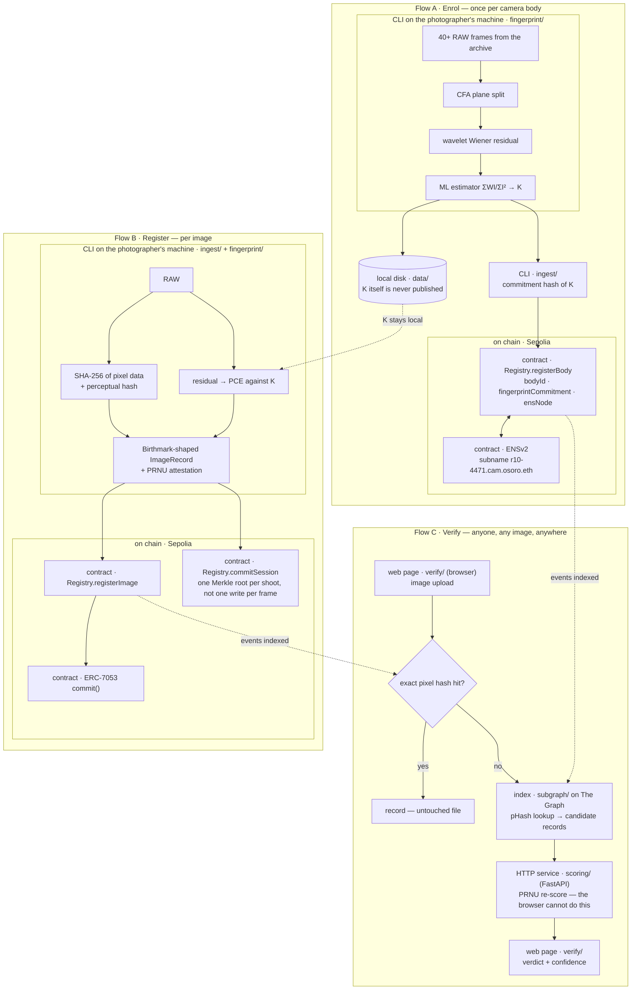

# Genesis

**Origin registry for photographers — prove an image came out of a specific camera body.**

ETHOnline 2026 · 4–16 September

---

> *Let there be light* — and a record of the sensor it fell on.

The photo world is trying to verify a negative — proving an image *wasn't*
AI-generated. It can't be done. We verify the positive instead: every image
sensor carries a permanent, per-body physical fingerprint (PRNU) that imprints
on every exposure and cannot exist in an image that never passed through it.
We register it and certify **origin, not truth**.

The record model follows the Birthmark Standard (arXiv 2602.04933,
`github.com/Birthmark-Standard/Birthmark`), which authenticates camera origin
from pixel data alone — NUC maps on professional bodies, PRNU on phones — and
explicitly scopes out the staged-photograph problem.

Its verification path references manufacturer key tables — a manufacturer
validates the NUC hash — and its own roadmap concedes that adoption needs
manufacturer firmware integration. We enrol from the photographer's own files
instead: 40+ RAW frames from an archive that already exists, with no
manufacturer and no platform involved. The camera's own data is the whole
input — K is estimated from the frames the body produced, so nothing outside
them is needed to enrol a body or to score an image against it.

We certify: exposed on camera body X · camera body registered to identity Y · first
registered at time T · these derivatives descend from that original.

`BUILD.md` is the source of truth. Where it and this README disagree,
`BUILD.md` wins.

## Layout

```
fingerprint/   Python — PRNU extraction, PCE scoring
ingest/        Python — record construction, hashing, Merkle session batching
contracts/     Solidity + Foundry — ERC-7053 commit() and the body registry
identity/      ENSv2 on Sepolia — body subname registration
subgraph/      The Graph — index registrations, resolve image → record
scoring/       FastAPI — HTTP wrapper around the scorer
verify/        web page — upload, score, look up, verdict
mcp/           Subgraph MCP server
docs/          claims discipline, gate results, demo script
data/          local scratch: enrolment frames, references (gitignored)
```

Python does the imaging because the CR3 decoders and the wavelet denoising
the PRNU pipeline depends on live there. FastAPI puts the scorer behind HTTP
so the verify page and the contracts side never import the imaging code.
Solidity and Foundry hold the registry, The Graph makes an image lookup
resolve to a record, and the chain is Ethereum Sepolia because that is where
ENSv2 is deployed.

## How it works



The lower branch of Verify is the one that matters. An exact pixel hash dies
the moment a platform re-encodes or resizes, and everything that has been out
in the world has been re-encoded.

## Getting started

Python 3.11+ (`numpy` 2.x removed `ndarray.ptp()` — use `np.ptp()`).

```bash
python3 -m venv .venv && source .venv/bin/activate
pip install -r requirements.txt
python3 fingerprint/fingerprint.py demo      # must PASS before anything else

uvicorn scoring.app:app --reload
```

Contracts (`forge init` was not run here — the tree is already laid out):

```bash
curl -L https://foundry.paradigm.xyz | bash && foundryup
cd contracts
forge install foundry-rs/forge-std OpenZeppelin/openzeppelin-contracts
forge build && forge test
```

## The gates

Nothing downstream matters until both have run. See `docs/gates.md`.

- **Gate A** — does K exist on this body? 40–50 defocused flats, CR3 not
  C-RAW, Long Exposure NR off.
- **Gate B** — does K survive a web JPEG round trip?

## Status

The enrolment math is written and passes on a synthetic sensor: CFA split,
wavelet Wiener residual, ML estimator, zero-mean plus DFT Wiener
post-processing, PCE, and the pinned commitment hash. `enroll`, `test` and
`pair` run against RAW files; `demo` runs without a camera.

Everything else in this tree is still a stub — ingest, contracts, subgraph,
scoring, verify. The Gate B crop-and-scale search is not written.

No real camera frames have been through it. Neither gate in `docs/gates.md`
has run, so nothing here is evidence that the fingerprint survives a real raw
pipeline.

## Further Work?

We never say "authentic", "AI-free", "verified real", or that the absence of a
record means anything. A camera pointed at a high-quality screen produces a
genuine exposure of a fabricated scene and defeats every provenance system on
the market, including in-camera cryptographic signing. See `docs/claims.md`.
