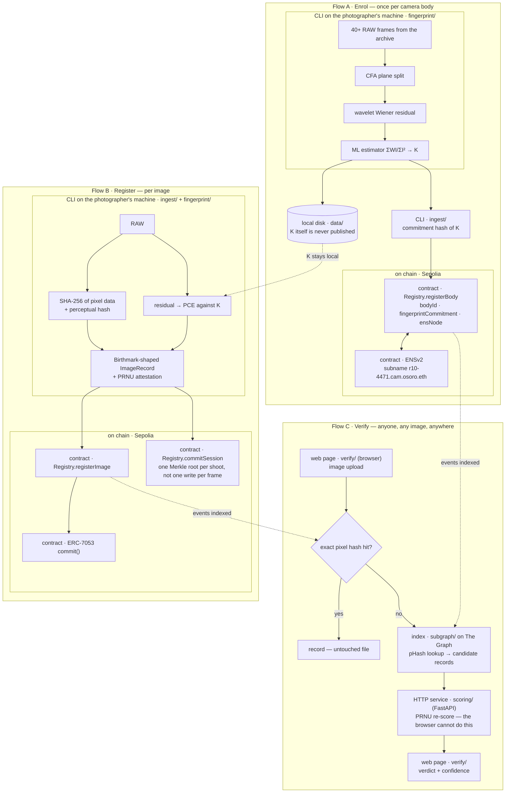

<p align="center">
  <picture>
    <source media="(prefers-color-scheme: dark)" srcset="logos/genesis-lockup-horizontal-white.png">
    
  </picture>
</p>

**Origin registry for photographers — prove an image came out of a specific camera body.**

ETHOnline 2026 · 4–16 September

---

> *Let there be light* — and a record of the sensor it fell on.

The photo world is trying to verify a negative — proving an image *wasn't*
AI-generated. It can't be done. We verify the positive instead: every image
sensor carries a permanent, per-body physical fingerprint (PRNU) that imprints
on every exposure and cannot exist in an image that never passed through it.
We register it and certify **origin, not truth**.

The record model follows the Birthmark Standard (arXiv 2602.04933,
`github.com/Birthmark-Standard/Birthmark`), which authenticates camera origin
from pixel data alone — NUC maps on professional bodies, PRNU on phones — and
explicitly scopes out the staged-photograph problem.

Its verification path references manufacturer key tables — a manufacturer
validates the NUC hash — and its own roadmap concedes that adoption needs
manufacturer firmware integration. We enrol from the photographer's own files
instead: 40+ RAW frames from an archive that already exists, with no
manufacturer and no platform involved. The camera's own data is the whole
input — K is estimated by maximum likelihood from the frames the body itself
produced, so nothing outside them is needed to enrol a body or to score an
image against it.

We certify: exposed on camera body X · camera body registered to identity Y · first
registered at time T · these derivatives descend from that original.

## The maths behind K

A sensor's photosites differ slightly in how much charge each returns for the
same light. That gain error is fixed at manufacture, unique to the die, and
it multiplies the signal rather than adding to it:

```
I = I⁰ + I⁰·K + Θ
```

`I` is what the sensor read, `I⁰` the light that fell on it, `K` the
per-pixel gain field — the fingerprint — and `Θ` everything else, shot noise
and dark current. Because K multiplies I⁰, a bright pixel carries more
evidence of K than a dark one, and a saturated pixel carries none.

Enrolment recovers K from frames alone. Each frame is denoised and the
denoised copy subtracted from the original, leaving a residual
`W = I − denoise(I)` that holds the fingerprint plus noise. Maximum likelihood over `d` frames then gives:

```
K̂ = Σ(Wₖ · Iₖ) / Σ(Iₖ²)
```

Each frame is weighted by its own intensity, which is exactly the weighting
the multiplicative model calls for. The model is linear, so this estimator is
minimum-variance unbiased and its variance falls as 1/d — more frames, a
sharper K, with no ceiling other than patience.

Verification asks whether a candidate image's residual contains that body's
fingerprint, scaled by the candidate's own intensity. The statistic is Peak
to Correlation Energy: correlate `W` against `I·K̂`, take the peak over all
shifts, divide its square by the energy in every other shift. PCE is used
rather than plain correlation because it is alignment-independent and its
null distribution is stable enough to set one threshold across bodies.

Two properties are what make this work retroactively. K is a property of the
silicon, not of the file, so stripping metadata removes nothing. And K is
never published — only a hash of it goes on chain, because a published
fingerprint is a forgery kit.

The full derivation is Fridrich, *Digital Image Forensics Using Sensor Noise*,
IEEE Signal Processing Magazine 26(2), 2009: sensor model eq. (3), estimator
eq. (6), variance bound eq. (7), PCE eq. (14), denoiser in Appendix A.

## Where this stands on real cameras

One body has been tested: a Canon EOS R10, 41 CR3 frames, 16 enrolled. Every
one of the 25 frames that did not build the fingerprint scores as a match —
672 at worst, 56,255 at best, against a null of 29 to 43. That includes
frames up to 17.7% blown out.

It worked on frames that break four of the five enrolment conditions: ordinary
photographs rather than defocused flats, **C-RAW rather than lossless CR3**,
High ISO NR on, and mostly not base ISO. Surviving Canon's lossy raw
compression matters more than the rest, because C-RAW is what a great many
photographers actually shoot.

What that does not yet establish: **the false-positive rate.** With one body
available the negative control is K rotated 180°, which destroys alignment
while preserving the statistics. That bounds the error the way a second
camera would, but it is not the same evidence. The case that matters most is
two bodies *of the same model*, which share every model-level artefact and
differ only in the fingerprint itself. Until that runs, the PCE threshold of
50 is provisional and no claim about how often a wrong body matches can be
made from this repo.

Method, numbers and the rest of the findings are in `docs/gates.md`.

## Layout

```
fingerprint/   Python — PRNU extraction, PCE scoring
ingest/        Python — record construction, hashing, Merkle session batching
contracts/     Solidity + Foundry — ERC-7053 commit() and the body registry
identity/      ENSv2 on Sepolia — body subname registration
subgraph/      The Graph — index registrations, resolve image → record
scoring/       FastAPI — HTTP wrapper around the scorer
verify/        web page — upload, score, look up, verdict
mcp/           Subgraph MCP server
docs/          claims discipline, gate results, demo script
data/          local scratch: enrolment frames, references (gitignored)
```

Python does the imaging because the CR3 decoders and the wavelet denoising
the PRNU pipeline depends on live there. FastAPI puts the scorer behind HTTP
so the verify page and the contracts side never import the imaging code.
Solidity and Foundry hold the registry, The Graph makes an image lookup
resolve to a record, and the chain is Ethereum Sepolia because that is where
ENSv2 is deployed.

## How it works



The lower branch of Verify is the one that matters. An exact pixel hash dies
the moment a platform re-encodes or resizes, and everything that has been out
in the world has been re-encoded.

## Getting started

Python 3.11+ (`numpy` 2.x removed `ndarray.ptp()` — use `np.ptp()`).

```bash
python3 -m venv .venv && source .venv/bin/activate
pip install -r requirements.txt
python3 fingerprint/fingerprint.py demo      # must PASS before anything else

uvicorn scoring.app:app --reload
```

Contracts (`forge init` was not run here — the tree is already laid out):

```bash
curl -L https://foundry.paradigm.xyz | bash && foundryup
cd contracts
forge install foundry-rs/forge-std OpenZeppelin/openzeppelin-contracts
forge build && forge test
```

## The gates

Nothing downstream matters until both have run. See `docs/gates.md`.

- **Gate A** — does K exist on this body? 40–50 defocused flats, CR3 not
  C-RAW, Long Exposure NR off.
- **Gate B** — does K survive a web JPEG round trip?

## Status

| | Component | State |
| --- | --- | --- |
| ██████████ | `fingerprint/` — enrolment, scoring, commitment | done, 7 tests |
| ██████████ | Gate A — does K exist on this body | **passed**, one body |
| ███████░░░ | Gate B — does K survive the web | **conditional pass** |
| ██████████ | `fingerprint/stress.py` — degradation ladder | done |
| ██████████ | `ingest/` — hashing, record, Merkle | done, 17 tests |
| ░░░░░░░░░░ | `contracts/` — ERC-7053 registry | 6 functions revert |
| ░░░░░░░░░░ | `identity/` — ENSv2 subnames | not started |
| ░░░░░░░░░░ | `subgraph/` — image → record | not started |
| ░░░░░░░░░░ | `scoring/` — FastAPI wrapper | 2 stubs |
| ░░░░░░░░░░ | `verify/` — the page | not started |
| ░░░░░░░░░░ | `mcp/` — Subgraph MCP server | not started |

Four of eleven done. The imaging core works on real files: `enroll`, `test`
and `pair` run against RAW and delivered JPEGs, `demo` runs without a camera.
Everything downstream of it is scaffolding.

`docs/e2e-checklist.md` is the ordered list of what unblocks what.

## Further Work?

We never say "authentic", "AI-free", "verified real", or that the absence of a
record means anything. A camera pointed at a high-quality screen produces a
genuine exposure of a fabricated scene and defeats every provenance system on
the market, including in-camera cryptographic signing. See `docs/claims.md`.
