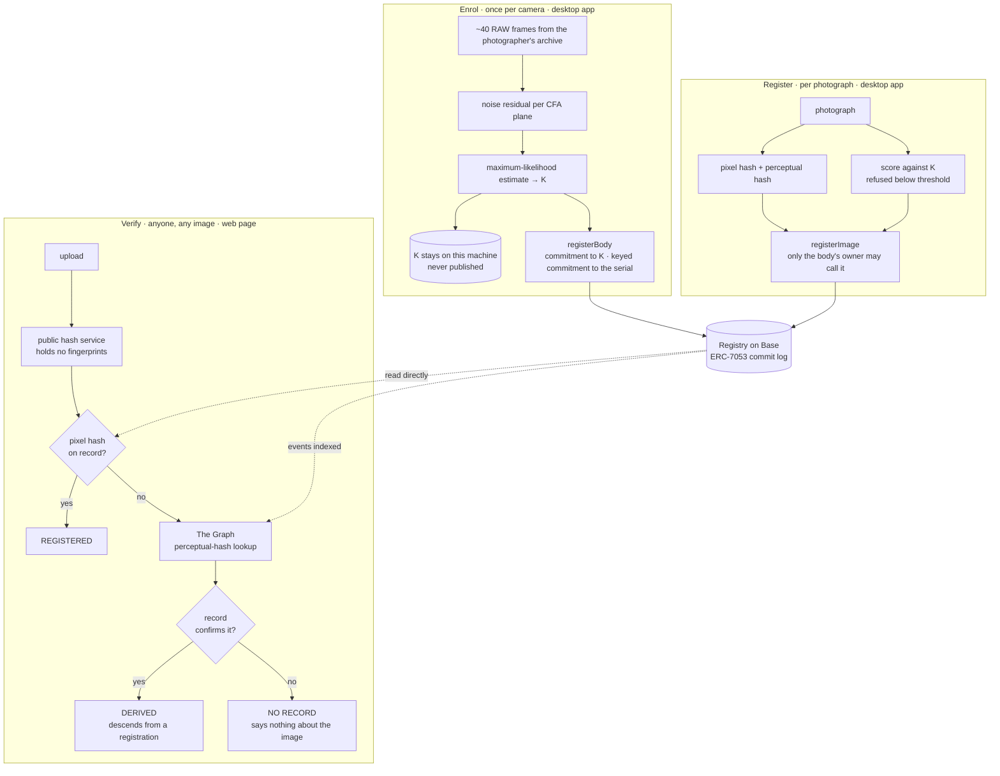

  <picture>
    <source media="(prefers-color-scheme: dark)" srcset="logos/genesis-lockup-horizontal-white.png">
    
  </picture>

**Register your photographs against the camera that took them, and let anyone
check a copy that has already left.**

Colosseum · Crypto World's Fair 2026 · built on Base · rehearsed on Base Sepolia, mainnet next

---

AI-generated images now pass for photographs, and the industry's answer,
signing inside the camera, exists on a handful of flagship bodies and covers
nothing already shot. The photo world is trying to prove a negative: that an
image *wasn't* generated. Genesis records a positive instead.

Every image sensor has a permanent, per-body noise pattern (PRNU) that is
imprinted on every exposure. Genesis learns it from about 40 RAW files a
photographer already has, on their own machine, and lets them register their
photographs on a public record under their own signature. Later, anyone can
check whether a copy (stripped, resized, re-posted) traces back to one of
those registrations.

**We certify two things and nothing else:**

1. body X's **owner** registered this image at time T, and
2. these pixels correlate with body X's fingerprint at PCE *p*.

Never the second alone. We attacked our own system: anyone holding one RAW
file off a body can plant its fingerprint in an image the camera never took,
invisibly. That result, with every number and the three we corrected, is in
[`docs/adversarial.md`](docs/adversarial.md). The owner's signature carries
the claim, and we never say "authentic", "AI-free", or that a missing record
means anything ([`docs/claims.md`](docs/claims.md)).

It works on the camera the photographer already owns. PRNU covers the archive
that exists; in-camera signing (C2PA) covers what is shot from now on.

## How it works

**Enrol.** The desktop app reads the RAW files, extracts each frame's noise
residual and estimates K. Only a hash of K goes on the record; K itself never
leaves the machine, because a published fingerprint is a forgery kit. The
photographer can also commit, under their own key, to the camera's make,
model and serial, which they reveal only if a claim is ever disputed.

**Register.** Each photograph is scored against K and refused if the pixels do
not support it. Otherwise its pixel hash, perceptual hash and a dated record go
on the registry. The contract accepts it only from the key that owns the
camera. That check is the one boundary no attack in `docs/adversarial.md` got
past. In progress for Colosseum: photographers need no wallet and no crypto,
because the app holds their key and a relayer pays the fee.

**Verify.** Anyone drops an image on the web page. An exact pixel hash means
this is the registered file. A resized or re-encoded copy has a different
hash, so the perceptual hash finds the original through The Graph, and the
registry confirms it before anything is shown. The public service only
hashes; fingerprint scoring happens on the photographer's machine, where K is.

Where K lives, what the stored score does and does not mean, and why scoring
in the cloud or with a proof is future work:
[`docs/security.md`](docs/security.md).

## The maths

A sensor's photosites differ slightly in how much charge each returns for the
same light. That gain error, K, is fixed at manufacture and multiplies the
signal. Genesis estimates it by maximum likelihood over the enrolment frames
and verifies with Peak to Correlation Energy (PCE).

- [`docs/camera-sensors.md`](docs/camera-sensors.md): the physics, with
  references
- [`fingerprint/prnu.py`](fingerprint/prnu.py): the implementation, citing
  equations by number
- J. Fridrich, [*Digital Image Forensics Using Sensor
  Noise*](http://ws2.binghamton.edu/fridrich/Research/full_paper_02.pdf), IEEE
  Signal Processing Magazine 26(2), 2009: sensor model eq. (3), estimator
  eq. (6), variance eq. (7), PCE eq. (14)
- [`docs/gates.md`](docs/gates.md): measured on a real Canon R10, including
  what survives the web

---

Built for ETHOnline 2026; that submission is preserved at the
[`ethonline-submission`](../../tree/ethonline-submission) tag, pinned to
commit [`1e2f392`](../../tree/1e2f392) so it stays reachable even if the tag
ever moves.
