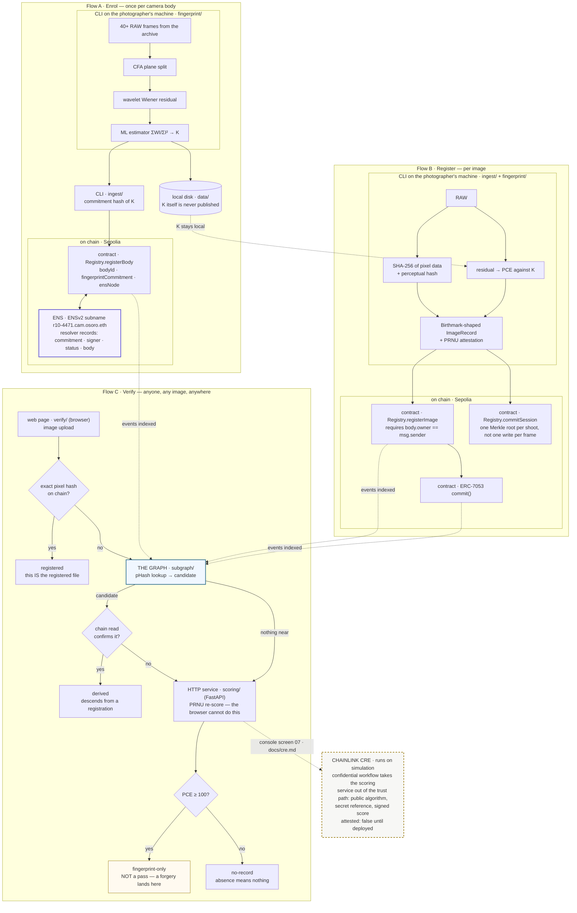

<p align="center">
  <picture>
    <source media="(prefers-color-scheme: dark)" srcset="logos/genesis-lockup-horizontal-white.png">
    
  </picture>
</p>

**Origin registry for photographers — prove an image came out of a specific camera body.**

ETHOnline 2026 · 4–16 September

---

> *Let there be light* — and a record of the sensor it fell on.

The photo world is trying to verify a negative — proving an image *wasn't*
AI-generated. It can't be done. We verify the positive instead: every image
sensor carries a permanent, per-body physical fingerprint (PRNU) that imprints
on every exposure and cannot exist in an image that never passed through it.

**We certify two things and nothing else:**

1. these pixels correlate with body X's fingerprint at PCE *p*, and
2. body X's **owner** registered this image on chain at time T.

Never the first alone. The fingerprint can be planted by anyone holding one
RAW file off the body, invisibly — measured, in `docs/adversarial.md`. The
owner's signature is what carries the claim. We never say "authentic",
"AI-free", or that the absence of a record means anything.

Enrolment needs nothing but the photographer's own archive: 40+ RAW frames
they already have, no manufacturer and no platform. `docs/camera-sensors.md`
is the physics; `docs/claims.md` is the closed list of what we will and will
not say.

## What it looks like

| | |
| --- | --- |
|  | **Register** — scored, refused below threshold, then signed. Every phase timestamped, because the wait is PRNU scoring rather than the chain. |
|  | **Survival** — metadata stripped, resized to 1800px, re-encoded. Different pixel hash, and it still resolves at PCE 314.9 through the pHash-plus-PRNU branch. |
|  | **No record** — and the three stages that produced it. Only stage 3, the chain read, grants a claim. |
|  | **Pre-flight** — everything that can fail on camera, checked before recording. The registry says it is a test registry and offers to wipe itself, because a date it can withdraw is not a date to rely on. |

More in [`screenshots/`](screenshots/).

## The maths behind K

A sensor's photosites differ slightly in how much charge each returns for the
same light. That gain error is fixed at manufacture, unique to the die, and it
**multiplies** the signal:

```
I  = I⁰ + I⁰·K + Θ          the sensor model
K̂  = Σ(Wₖ · Iₖ) / Σ(Iₖ²)    maximum likelihood over d frames
```

`W = I − denoise(I)` is the residual that holds the fingerprint. Each frame is
weighted by its own intensity, which is what the multiplicative model calls
for; the estimator is minimum-variance unbiased and its variance falls as 1/d.
Verification correlates `W` against `I·K̂` and scores it by Peak to Correlation
Energy — alignment-independent, with a null stable enough for one threshold
across bodies.

Two properties make it work retroactively: **K is a property of the silicon,
not the file**, so stripping metadata removes nothing — and K is never
published, because a published fingerprint is a forgery kit. The same
estimator that reads K can plant it.

Derivation: Fridrich, *Digital Image Forensics Using Sensor Noise*, IEEE SPM
26(2), 2009 — model eq. (3), estimator eq. (6), variance eq. (7), PCE eq. (14).

## Where this stands on real cameras

One body tested: a Canon EOS R10, 41 CR3 frames, 16 enrolled.

| | |
| --- | --- |
| Held-out own frames | **672 to 56,255**, all 25 of them, against a null of 29–43 |
| A **different R10** (same model) | **39.1**, and −44.0 through the orientation search — the null band |
| Cross-model (5D Mark III) | 26.6 |
| Threshold | 100 — about twice the worst null, well under the weakest true match |

It worked on frames breaking four of the five enrolment conditions: ordinary
photographs rather than flats, **C-RAW rather than lossless**, High ISO NR on,
mostly not base ISO. C-RAW surviving matters most, because it is what many
photographers actually shoot.

One negative body is **not a false-positive rate.** It rules out a broken
approach; it does not say how often a wrong body matches, which needs dozens.

**In-camera JPEGs carry no readable fingerprint** — the sharpest limit here.
Four straight off the card score 24.7, 18.5, −29.2, 29.6: the null band. The
same sensor developed from RAW on a desktop scores 1,148. Not geometry — by
region a desktop development grows with area (78 → 206 → 1,293) while the
in-camera file is flat at the null (24 → −27 → 30). The fingerprint is gone,
and the likely cause is in-camera noise reduction. **The camera deletes the
fingerprint because to the camera it is noise.**

So enrol, register and verify from RAW or a desktop development. Monochrome is
fine — desaturated scores 1,503 against 1,182 in colour. Method and the rest
of the numbers: `docs/gates.md`.

## Live on Sepolia

Deployed, source-verified on **both** explorers, and carrying a real body and
real photographs — not a local chain.

**[`0xd1bbDB8A6BfD25563d2e6444fA41E4C5230Ed3C9`](https://sepolia.etherscan.io/address/0xd1bbDB8A6BfD25563d2e6444fA41E4C5230Ed3C9)**
· [Blockscout](https://eth-sepolia.blockscout.com/address/0xd1bbDB8A6BfD25563d2e6444fA41E4C5230Ed3C9)
· [The Graph](https://thegraph.com/studio/subgraph/genesis)

One body (`0x653c40dd…`, ENS node the namehash of `r10-4471.cam.osoro.eth`)
and five registered photographs, PCE 7,739 to 409,355. `registerImage` emits
`ImageRegistered` **and** an ERC-7053 `Commit`, so an indexer that knows only
the standard sees it too.

**This is a test registry, deliberately.** `testMode()` returns true, giving
its administrator one call — `resetAll` — that makes every record unreachable
so the demo can be rehearsed without redeploying. `bodyId` derives from
`SHA-256(K)`, so without it the same camera is locked out after one run. It
also means **a registration date here is not one to rely on**: the verify page
reads the flag and says so on every verdict, and `docs/claims.md` marks claim
1 provisional on this deployment. A production registry passes the flag false,
and the constructor **refuses** it on any chain not in an explicit testnet
list.

The first deployment, `0xDf71e935…`, stored the body's `ensNode` as
`keccak256(name)` where EIP-137 wants the recursive namehash — so it pointed
at a name that resolves to nothing. `ensNode` has no setter and `registerBody`
reverts on a duplicate `bodyId`, so it could not be corrected in place.
Redeployed rather than documented around: "body X is registered to identity Y"
is one of the two claims and it has to survive being checked.

**Check it yourself without trusting this page.** The source is verified, so
the *Read contract* tab needs no wallet:

- `deriveBodyId` with `0x3c00867d1717c0fc33eb28c25ffff2dfddc9af65c8952a5d6f52f7c5e52894c6`
  — the commitment `enroll` printed — returns `0x653c40dd…`, the same body id
  `ingest/record.py` derives locally. The Python and the Solidity agree about
  which camera this is.
- `images` with `0xd03e71c254a338b374dd75ed023fe9a00ecbf17abd2b681530b6b8187a33f598`
  returns that body, PCE 10,439, and the registration time.
- `bodies` with the body id returns the fingerprint **commitment** — a hash.
  K itself is not there, and never will be.

The body behind these records is the demo body whose frames were published and
then withdrawn, so treat it as burned rather than as a live registration.

## Validate the mathematics yourself

**The test frames are not in this repository.** Publishing 16 enrolment
frames publishes everything needed to reconstruct K for that body, and the
[fingerprint-copy attack](https://dlnext.acm.org/doi/10.1109/TIFS.2010.2099220)
needs nothing more than that to forge images this project would attribute to
that camera. So the numbers in `docs/gates.md` are reported rather than
handed over, and here is what you can check for yourself instead.

**No files needed.** The synthetic sensor has a known ground-truth
fingerprint, so this proves the estimator recovers what it is given:

```bash
python3 fingerprint/fingerprint.py demo
pytest fingerprint ingest        # 68 tests
```

**With your own camera.** 40+ RAW frames from an archive you already have:

```bash
python3 fingerprint/fingerprint.py enroll --out data/references/mine.npz ~/photos/*.CR3
python3 fingerprint/fingerprint.py test --fingerprint data/references/mine.npz ~/other/*.CR3
```

**The different-body test, from public data.** [raw.pixls.us](https://raw.pixls.us/)
is a public archive of camera raw samples. Take any body of the same model as
your own and score it against your fingerprint; it should land in the null
band, in the tens, against thousands for your own frames. That is the
experiment that decides whether any of this means anything, and it needs no
files from us.

Check `exiftool -SerialNumber` before trusting a file as a different body.
Two candidates for that role here turned out to be the same camera.

## The console

Eight screens driven by one presenter on localhost, built to
`design_handoff_genesis_console/`. Registration and verification go through
one scorer, so the two cannot disagree about the same photograph.

```
00 PRE-FLIGHT  01 ENROL  02 REGISTER  03 NEGATIVE
04 SURVIVAL    05 VERDICT  06 ARCHIVE  07 CONFIDENTIAL
```

Every registration is a timestamped log of the real phases — reading, scoring
with the search's own *n of 21*, building the record, signing, broadcasting,
receipt. Named because the wait is dominated by PRNU scoring rather than by
the chain, and a screen that said "broadcasting" while running the search
taught operators to distrust a chain that was not the problem.

**Under every verdict, the stage strip.** Stage 1 decides only whether to look
further. Stage 2 is labelled **advisory — decides nothing** and carries each
signal's measured AUC beside its value, because a weak number read without its
error bar becomes a strong one. Stage 3, the chain read, is the only stage
that grants a claim and the only one drawn in a heavy rule.

Two rules hold the grammar together. Scores render in identical ink whatever
their magnitude, and the rail is logarithmic from 1 to 100,000 — because a
forged image scores 82,190 and a genuine degraded photograph scores 37.3, so
**no size, colour or bar length may imply trust**. The verdict word is the
claim; the number beside it is a measurement.

On-chain values link out to where anyone can read them back: Etherscan and
Blockscout for the transaction and the contract, The Graph for the index,
app.ens.dev for the namespace. A claim nobody is shown how to check is a claim
taken on trust.

## The technologies, and what each one carries

Every one of these does work the product would not function without. Where a
piece is not built, the table says so rather than implying it.

| Technology | What it carries here | Status |
| --- | --- | --- |
| **Ethereum (Sepolia)** | `Registry.sol` — the body registry, image records, session roots and the ERC-7053 commit log. `registerImage`'s `require(body.owner == msg.sender)` is the system's only real security boundary | **Live** — `0xd1bbDB8A…`, block 11694580, verified on Blockscout *and* Etherscan |
| **ENS (ENSv2, Sepolia)** | The identity model *is* the hierarchy: `osoro.eth` is the photographer, `cam.osoro.eth` the fleet, `r10-4471.cam.osoro.eth` one enrolled body, with the fingerprint commitment, signer, revocation status and a keyed camera-serial commitment in its resolver records | **Live** — registered, and both subregistries deployed by hand because the beta app has no subname UI (`identity/addresses.md`) |
| **The Graph** | The perceptual index. A degraded copy has a different pixel hash, so the only way back to the original's registration is a pHash lookup — the registry has no index on it, so the subgraph *is* that index. Demo step 4 depends on it | **Live** — `genesis` v0.0.4, indexing real Sepolia events, all four entity types populated, and it clears itself when the testnet registry is wiped |
| **The Graph (MCP server)** | Three read-only tools so an agent can verify conversationally, with the claims discipline enforced in the wording an agent repeats | **Live** — answering from the deployed subgraph, 6 tests on the wording |
| **Chainlink CRE** | Takes the scoring service out of the trust path — it is the trust hole by design, since today you take its word for a PCE. The confidential workflow makes the algorithm public, keeps the reference private and returns a *signed* score | **Runs, on simulation** — `cre/`, an HTTP trigger into a TEE handler, K from the Vault DON, driven from console screen 07. ~17s a run, deterministic. Deployment needs private-beta enrolment, which the prize criteria do not require. `docs/cre.md` |
| **ERC-7053** | The commit log shape, so a record is portable rather than ours alone | **Live** — `commit()` fires on every registration |
| **Foundry, viem, FastAPI, Vite** | Tooling: contracts and transactions, chain reads in the browser, the scorer and console, the two web surfaces | In use throughout |

### Where CRE actually stands

It runs. A real `cre workflow simulate` through the CRE CLI, compiling the
workflow to WASM on every run and executing it in the simulator: the residual
is extracted locally, a 256² int8 crop of K is released to the handler, and a
score comes back. About seventeen seconds, and deterministic — three
consecutive runs returned 17.8s, 16.1s, 16.2s and the same PCE every time.
Console screen 07 drives it, and `cre/capture-evidence.sh` writes the
transcript a submission needs.

Chainlink's criteria accept **either** a Confidential Workflow simulation via
the CLI **or** a live deployment. This is the first, so the private-beta gate
blocks deployment and blocks nothing else. `cre account access` still reports
deployment access not enabled, `cre account list-key` reports no linked
owners, and neither is needed to simulate.

Three honest notes, because it is easy to oversell after a day of adversarial
work. Confidential compute removes the *scorer* as a trusted party; it does
nothing about forgery — an enclave would score a planted fingerprint
faithfully and sign it. **Nothing available today produces a real
attestation**: the simulator is not an enclave and the local backend signs on
the machine that holds K, so `attested` is False on every path that can be
run, and the code refuses to let either claim otherwise. And the reference does
not fit an enclave — 89 MB against a 1 MB secret limit — so K is cropped, and
at that size the weakest frame in the corpus falls into the null. `docs/cre.md`
measures all three; `docs/security.md` says the first where someone would look
for it.

## Layout

```
fingerprint/   Python — PRNU extraction, PCE scoring
ingest/        Python — record construction, hashing, Merkle session batching
contracts/     Solidity + Foundry — ERC-7053 commit() and the body registry
identity/      ENSv2 on Sepolia — body subname registration
subgraph/      The Graph — index registrations, resolve image → record
scoring/       FastAPI — HTTP wrapper around the scorer
cre/           Chainlink CRE — confidential scoring, two backends behind a flag
verify/        web page — upload, score, look up, verdict
mcp/           Subgraph MCP server
docs/          the sensor physics, claims discipline, gate results, demo script
data/          local scratch: enrolment frames, references (gitignored)
```

Python does the imaging because the CR3 decoders and the wavelet denoising
the PRNU pipeline depends on live there. FastAPI puts the scorer behind HTTP
so the verify page and the contracts side never import the imaging code.
Solidity and Foundry hold the registry, The Graph makes an image lookup
resolve to a record, and the chain is Ethereum Sepolia because that is where
ENSv2 is deployed.

## How it works



The lower branch of Verify is the one that matters. An exact pixel hash dies
the moment a platform re-encodes or resizes, and everything that has been out
in the world has been re-encoded.

## The offline run

Everything below the imaging core, without a testnet:

```bash
anvil &
contracts/script/local-e2e.sh data/references/r10.npz frame.CR3
```

Scores the frame, deploys the registry, registers the body and the
photograph, commits a session root, reads it back and proves inclusion. A
frame from another body is refused before it reaches the chain.

## Getting started

Python 3.11+ (`numpy` 2.x removed `ndarray.ptp()` — use `np.ptp()`).

```bash
python3 -m venv .venv && source .venv/bin/activate
pip install -r requirements.txt
python3 fingerprint/fingerprint.py demo      # must PASS before anything else

uvicorn scoring.app:app --reload
```

Contracts (`forge init` was not run here — the tree is already laid out):

```bash
curl -L https://foundry.paradigm.xyz | bash && foundryup
cd contracts
forge install foundry-rs/forge-std OpenZeppelin/openzeppelin-contracts
forge build && forge test
```

## The gates

Nothing downstream matters until both have run. See `docs/gates.md`.

- **Gate A** — does K exist on this body? Asked for 40–50 defocused flats,
  CR3 not C-RAW, Long Exposure NR off. **Passed on frames that broke four of
  the five**, which is the better news: an archive that already exists works.
- **Gate B** — does K survive a web JPEG round trip? Conditional pass —
  1800px at quality 95 scores 408, the same size at quality 80 scores 37. Any
  claim from that ladder has to name the quality.

Three later findings sit alongside them, each measured on real files: a flat
border defeats the scale search and not the fingerprint (37.9 → 31,676 once
stripped), portrait capture costs a delivered file the aligned path (282 →
838 turned back into sensor space), and in-camera JPEGs carry nothing at all.

## Status

| | Component | State |
| --- | --- | --- |
| ██████████ | `fingerprint/` — enrolment, scoring, commitment | done |
| ██████████ | Gate A — does K exist on this body | **passed**, one body |
| ███████░░░ | Gate B — does K survive the web | **conditional pass** — `docs/gates.md` names the quality |
| ██████████ | `ingest/` — hashing, record, Merkle | done |
| ██████████ | `contracts/` — ERC-7053 registry | **live on Sepolia**, verified on both explorers |
| ██████████ | `identity/` — ENSv2 subnames | **live** — parent and subregistries deployed; register, records and revoke all rehearsed on chain |
| ██████████ | `subgraph/` — image → record | **live**, `genesis` v0.0.4, all entity types from real events |
| ██████████ | `scoring/` — FastAPI wrapper | done |
| ██████████ | `verify/` — the page | four verdicts, driven in a browser against the live chain and index |
| ██████████ | `mcp/` — Subgraph MCP server | answers from the deployed subgraph |
| ██████████ | `console/` — demo orchestration API | eight screens wired; registration, sessions, archive and reset exercised live |
| █████████░ | `console-ui/` — the presenter console | eight screens built to the handoff |
| ████████░░ | `cre/` — confidential scoring | a real `cre workflow simulate` per run, from screen 07; both backends agree to the tenth. Deployment needs private-beta enrolment, which the criteria do not require |
| ██████████ | `docs/adversarial.md` — red team | the fingerprint forged three ways against our own reference |

**177 tests** — 133 pytest, 21 Foundry, 9 matchstick, 6 MCP, 8 identity.

**What a day of attacking it changed.** The fingerprint can be planted in an
image the camera never took, invisibly, by anyone holding **one RAW file** off
the body. So a PCE score is evidence of a link and never proof of origin, and
everything the product claims sits behind `registerImage`'s owner check — the
one mechanism no attack got past. There is no forgery-detection rate and none
should be quoted: measured separations are AUC 0.725 to 0.900 with every range
overlapping.

`docs/security.md` is the posture, `docs/claims.md` the closed list of two
claims, `docs/e2e-checklist.md` the ordered list of what unblocks what.

## Further Work?

We never say "authentic", "AI-free", "verified real", or that the absence of a
record means anything. A camera pointed at a high-quality screen produces a
genuine exposure of a fabricated scene and defeats every provenance system on
the market, including in-camera cryptographic signing. See `docs/claims.md`.
